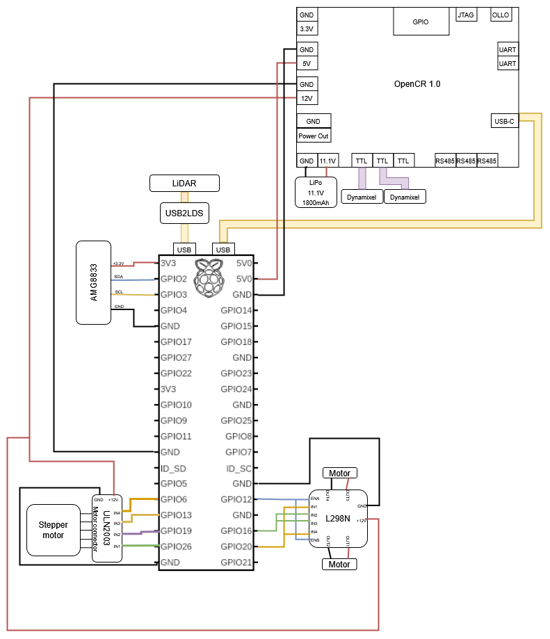

# Electronics info
## Component selection
For heat source detection, the AMG8833 sensor was used as it has a detection distance of up to 7 metres, allowing for the robot to identify heat sources from a sufficiently far distance without colliding with them. 

For the launcher mechanism, two flywheels were required to launch the ball and a stepper motor was required to feed balls to the flywheels. We used a 28BYJ-48 stepper motor which was packaged with a breakout board containing a ULN2003 motor driver, which allowed us to supply up to 12V for power. We used size 130 brushed DC motors for the flywheels due to their high RPM. The flywheels are controlled via a L298N motor driver as it can provide up to 2A of current. PWM was used to control the speed of the flywheels.

## Power budget
| **Component**       | **Voltage/V**     | **Current/A**   | **Power/W** | **Remarks**                     |
|-----------------|----------------|-------------|---------|------------------------------------------------|
| Turtlebot       | 12             | 0.66        | 7.92    |                                                |
| AMG8833         | 3.3            | 0.045       | 0.1485  | 3.3V from Raspberry Pi                         |
| Flywheel motors | 0.3 x 12 = 3.6 | 0.5 x 2 = 1 | 3.6     | Stall current is 0.5A. 30% duty cycle from RPi |
| Stepper motor   | 12             | 0.5         | 6       |                                                |
|  Total          |                |             | 17.67   |                                                |

*assume negligible current consumption by ULN2003 and L298N motor drivers

### Estimated battery life
The turtlebot is powered by a 11.1V 1800mAh Li-Po battery\
Battery energy = 11.1V x 1.8Ah = 19.98Wh\
Assuming approx. 15W average power use, since motors are only running during firing sequence\
Estimated battery life = 19.98Wh / 15W = 1.3h\

## Wiring diagram
