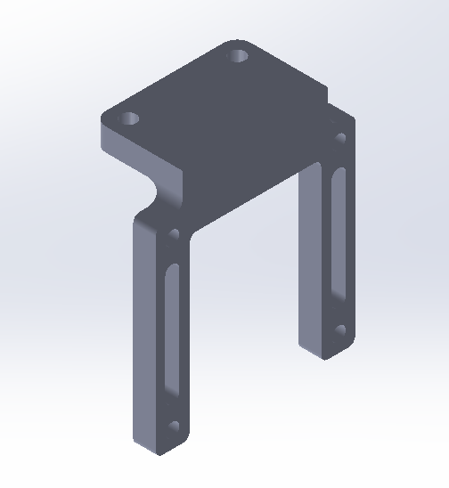

# Mechanical info
## Robot Overview
Below is the overview of the robot CAD, we adopted a flywheel launching mechanism with a sloped hopper design for smooth feeding. The robot CAD can be downloaded [here](https://drive.google.com/file/d/1z6XVp3NTTHMczwou05BLjMLxJpayefCc/view?usp=sharing).

## Launching Mechanism
For the launching mechanism we adopted a dual flywheel setup as this would give us sufficient control over the fire time between projectiles. We would also be able to easily modify our launcher should the projectile height requirements change.

For this mechanism, we used two DC motors to power the flywheels and a stepper motor to feed balls into the flywheels.

The calculation for the flywheel motors is shown below.

This launcher mechanism is attached to the robot using 4 M3 screws to two different layers on our turtlebot.

## AMG8833 Sensor Mount
The sensor mount is attached to the turtlebot with two M3 screws. The sensor is attached to the mount with two M2 screws.

## L298N Motor Driver Mount
The L298N motor driver mount is attached to the turtlebot with two M3 screws. The motor driver is attached to the mount with four M2.5 screws. The long holes on the sides are for the pins on the back of the motor driver.

## Stepper Motor Driver Mount
The stepper motor driver mount is attached to the turtlebot with two M4 screws. The motor driver is attached to the mount with four M2.5 screws.

## Counterweight
The counterweight holder is attached to the turtlebot with two M3 screws. We put twelve M8x25 socket head screws inside. We discovered that the robot rocks forwards and backwards due to the weight of the launching mechanism, as such we created a counterweight holder to shift the center of gravity towards the middle of the robot.

## Parts Fabrication
All parts for the launcher were 3D printed, on a Bambulab A1 printer with a 0.4mm nozzle on a smooth PEI plate. The filament used was esun PLA+. For the print the default 0.20mm Standard @BBL_A1 print settings from Bambu Studio were chosen. Other than the parts labeled “barrel guide_V2” ,“feedpath bend_V2” and “hopper bottom_V2” which were printed with tree supports, the rest were printed without supports. For the part “clamp1_V2” 4 pieces were printed and for “motor interface_v3” 2 pieces were printed.

The print settings are shown here.

The orientation of various parts are shown here.

For the parts without support only default print settings were used and nothing was changed.

## Center of Gravity Calculation
In order for the robot to traverse up the ramp, we thought to keep the centre of gravity 1) As low as possible and 2) As close to the middle of the robot as possible. This was achieved by using M8 screws as counterweight. The centre of gravity is X: 39.27mm, Y: 42.46mm, Z: 82.80mm.

The calculations for the centre of gravity are shown in greater details [here](Centre_of_Gravity_Calculations.xlsx).

## Total Fasteners 
All the fasteners used are listed in the table below. 

**Launching Mechanism**
| Fastener            | Quantity |
|---------------------|----------|
| M3x15 screws        | 4        |
| M3 hex nuts         | 4        |
| M2.5x10 screws      | 8        |
| M2.5 hex nuts       | 8        |
| M4x20 screws        | 2        |
| M4 hex nuts         | 2        |

**AMG8833 Sensor Mount**
| Fastener            | Quantity |
|---------------------|----------|
| M3x15 screws        | 2        |
| M3 hex nuts         | 2        |
| M2.5x10 screws      | 2        |
| M2.5 hex nuts       | 2        |

**L298N Motor Driver Mount**
| Fastener            | Quantity |
|---------------------|----------|
| M3x15 screws        | 2        |
| M3 hex nuts         | 2        |
| M2.5x10 screws      | 4        |
| M2.5 hex nuts       | 4        |

**Stepper Motor Mount**
| Fastener            | Quantity |
|---------------------|----------|
| M4x15 screws        | 2        |
| M4 hex nuts         | 2        |
| M2.5x10 screws      | 4        |
| M2.5 hex nuts       | 4        |

**Counterweight**
| Fastener            | Quantity |
|---------------------|----------|
| M3x15 screws        | 2        |
| M3 hex nuts         | 2        |

**_Total_**
| Fastener            | Quantity  |
|---------------------|-----------|
| M2.5x10 screws      | 18        |
| M2.5 hex nuts       | 18        |
| M3x15 screws        | 10        |
| M3 hex nuts         | 10        |
| M4x20 screws        | 2         |
| M4x15 screws        | 2         |
| M4 hex nuts         | 4         |
