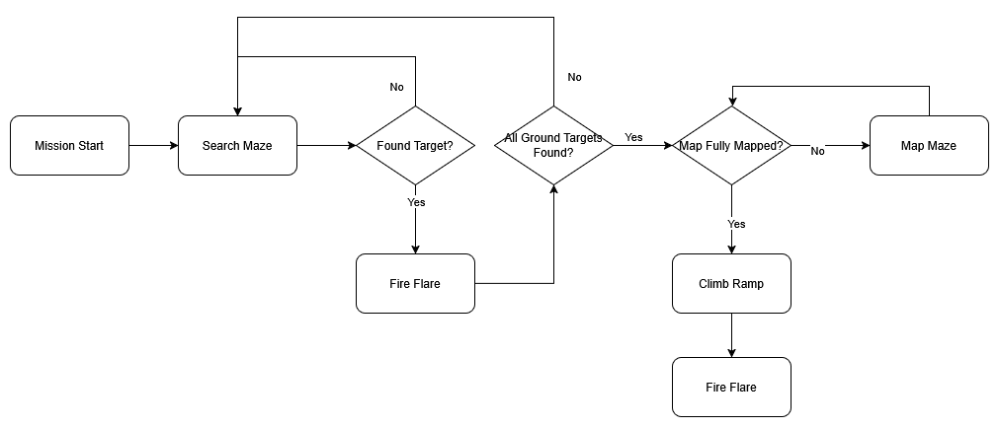

# CDE2310 AY 24/25 Group 5

## System requirements
This system uses a Turtlebot3 Burger with ROS2 Humble ([specifications](https://emanual.robotis.com/docs/en/platform/turtlebot3/features/#specifications) can be found on the Robotis website)\
The robot is required to autonomously navigate and fully map a maze. Upon detecting a heat source, the robot should approach the heat source, stop, and fire 3 ping pong balls in a firing sequence of 2-4-2s. The robot must detect two distinct heat sources in the maze. Optionally, the robot can scale a ramp and detect a third heat source in the ramp zone.

The full final mission details can be found [here](https://github.com/NickInSynchronicity/EG2310_AY2024-25/blob/main/docs/Mission%20Readme.md)

## Repository structure overview
```
— README.md
— Electronics               # this folder contains information for the electronics (heat sensor and launcher mechanism)
— Mechanical                # this folder contains information for the mechanical design of the launcher mechanism and mounts for heat sensor and motor drivers
— assets
— .gitattributes
— __init__.py
— helper_funcs.py           # helper functions to test robot functionality
— pathfinder.py             # computes path for robot to travel to decision point 
— mappingphase.py           # after both non-ramp heat sources are found, ensures map closure is achieved
— searchingphase.py         # publishes decision points for robot to navigate to
— survivorzonesequence.py   # heat source detection and launcher firing
— package.xml
— dev_scripts
—— r2z1.py                  # for debugging 
—— ramp.py                  # ramp test script
—— sensor_development       # scripts to test heat sensor
—— launcher_development     # scripts used for development of launcher system
—— board_integration        # other test scripts
— reference_scripts         # Scripts used as reference, including [original r2auto_nav scripts](https://github.com/NickInSynchronicity/r2auto_nav_CDE2310)
— tasks                     # in-class tasks and submissions
```

## High-level design
Our group's system functions as follows:



## Subsystem design

### Mechanical
See [mechanical_readme](Mechanical/mechanical_readme.md)
### Electrical
See [electronics_readme](Electronics/electronics_readme.md)

### Software
See [software_readme](software_readme.md)

## Testing documentation


## End user documentation
This repository can be downloaded as normal and built as a ROS2 workspace. Refer to [ROS2 Humble documentation](https://docs.ros.org/en/humble/Tutorials/Beginner-Client-Libraries/Creating-A-Workspace/Creating-A-Workspace.html) for more information. 


See [user manual](assets/end_user_documentation_v1.1.pdf) for details on operation
