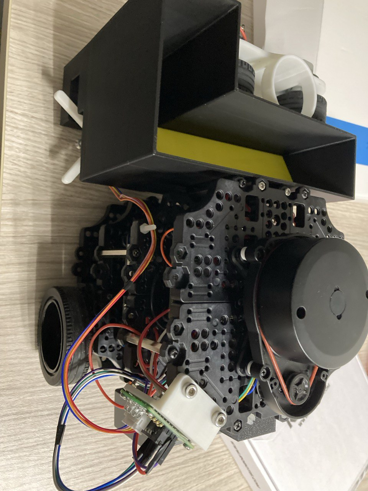
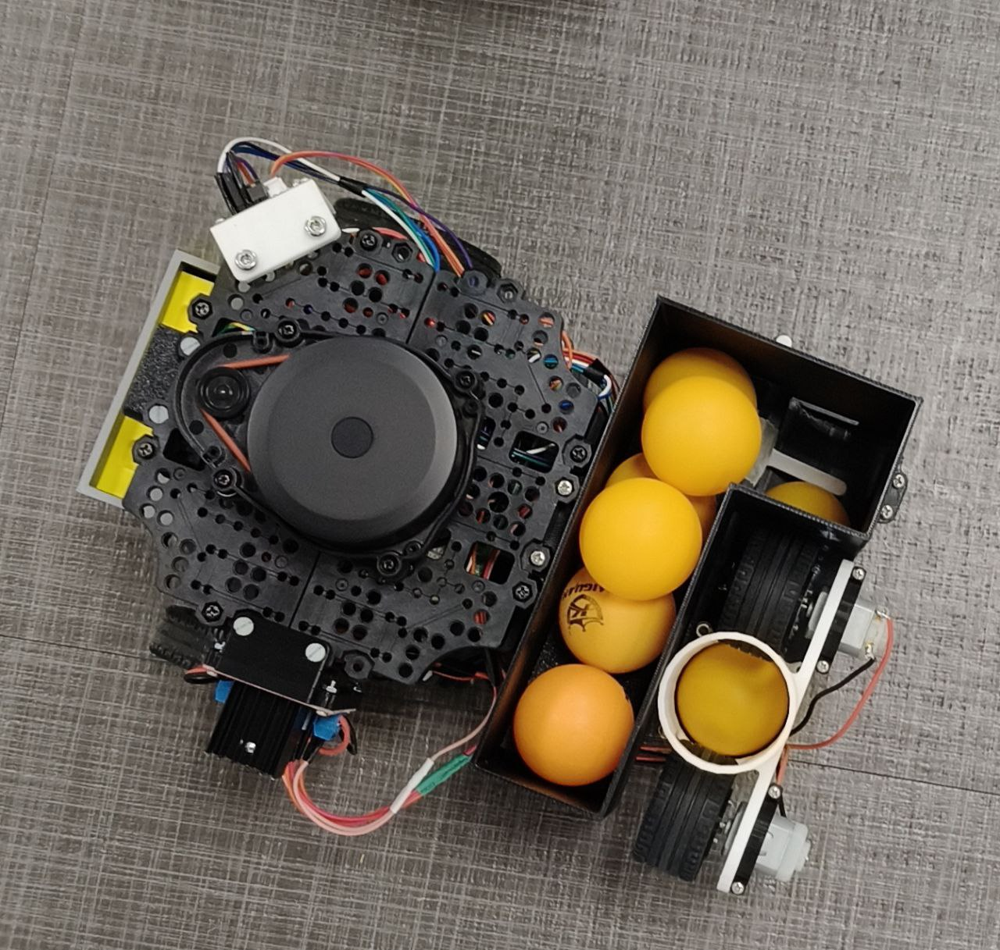

# CDE2310 AY 24/25 Group 5

## System requirements
This system uses a Turtlebot3 Burger with ROS2 Humble ([specifications](https://emanual.robotis.com/docs/en/platform/turtlebot3/features/#specifications) can be found on the Robotis website)\
The robot is required to autonomously navigate and fully map a maze. Upon detecting a heat source, the robot should approach the heat source, stop, and fire 3 ping pong balls in a firing sequence of 2-4-2s. The robot must detect two distinct heat sources in the maze. Optionally, the robot can scale a ramp and detect a third heat source in the ramp zone.

The full final mission details can be found [here](https://github.com/NickInSynchronicity/EG2310_AY2024-25/blob/main/docs/Mission%20Readme.md)

## Repository structure overview

- README.md
- Electronics               _this folder contains information for the electronics (heat sensor and launcher mechanism)_
- Mechanical                _this folder contains information for the mechanical design of the launcher mechanism and mounts for heat sensor and motor drivers_
- assets
- helper_funcs.py           _helper functions to test robot functionality_
- pathfinder.py             _computes path for robot to travel to decision point_
- mappingphase.py           _after both non-ramp heat sources are found, ensures map closure is achieved_
- searchingphase.py         _publishes decision points for robot to navigate to_
- survivorzonesequence.py   _heat source detection, launcher firing and ramp sequence_
- package.xml               _contains package dependencies_
- setup.py                  _creates entry points for the package_
- dev_scripts
    - r2z1.py                  _for debugging_
    - ramp.py                  _ramp test script_
    - sensor_development       _scripts used for development of heat source detection_
    - launcher_development     _scripts used for development of launcher system_
    - board_integration        _other test scripts_
- reference_scripts         _Scripts used as reference, including [original r2auto_nav scripts](https://github.com/NickInSynchronicity/r2auto_nav_CDE2310)_
- tasks                     _in-class tasks and submissions_

## High-level design
Our group's system functions as follows:

## Subsystem design

### Mechanical
See [mechanical_readme](Mechanical/mechanical_readme.md)
### Electrical
See [electronics_readme](Electronics/electronics_readme.md)

### Software
See [software_readme](software_readme.md)

## Testing documentation
- [amg_read_test](dev_scripts/sensor_development/amg_read_test.py) and [sensor_test](dev_scripts/sensor_development/sensor_test.py) are used for checking output from the sensor
- [amg_listener_test](dev_scripts/sensor_development/amg_listener_test.py) and [amg_publisher_test](dev_scripts/sensor_development/amg_publisher_test.py) are used for checking publishing of sensor data from RPi to remote PC via ROS2
- [r2z1.py](dev_scripts/r2z1.py) can be run on the remote PC to view debug messages during full operation of the system as described in the end user documentation

## End user documentation
This repository can be downloaded as normal and built as a ROS2 workspace. Refer to [ROS2 Humble documentation](https://docs.ros.org/en/humble/Tutorials/Beginner-Client-Libraries/Creating-A-Workspace/Creating-A-Workspace.html) for more information. 

See [user manual](assets/end_user_documentation_v1.1.pdf) for details on operation
