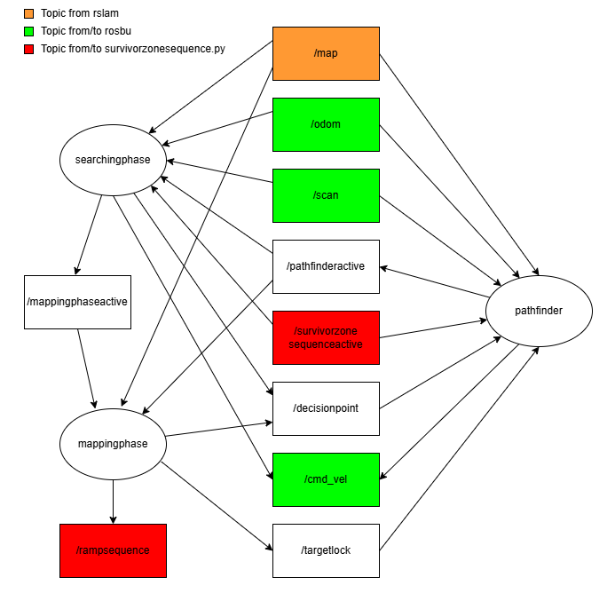
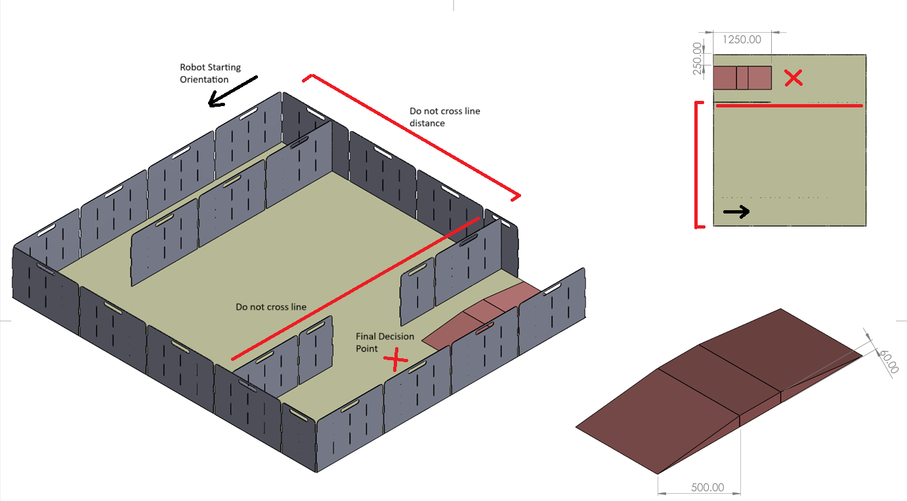

# Software info
## Overview
How to operate:
1. Turn on robot such that heading is the same as starting position in maze (or just turn it on in its starting position)
2. Ensure both rpi and remote laptop are connected to the same wifi
3. SSH into the rpi
4. Postion the robot with its heading parallel to bottom of the maze (see Map Parameters below)
5. To run the program, run the following commands in seperate terminals in the following order:
- rosbu (rpi)
- rslam (remote laptop)
- python3 survivorzonesequence.py (rpi)
- ros2 run auto_nav pathfinder (remote laptop)
- ros2 run auto_nav mappingphase (remote laptop)
- ros2 run auto_nav searchingphase (remote laptop)

The main nodes will interact with each other in the following manner:

## Map Parameters
Taking the ramp area as the top of the map, the robot will start at the bottom left or bottom right of the map. 
- If the robot starts at the bottom left, it must start facing rightwards
- If the robot starts at the bottom right, it must start facing leftwards

The do_not_cross_line distance is from the bottom wall to the ramp area and this variable must be updated in pathfinder.py, mappingphase.py and searchingphase.py. 
- If robot starts at the bottom left of the map, input distance as positive number
- If robot starts at bottom right of map, input distance as negative number

For the final decision point in mappingphase.py, only the x coordinate has to be updated in the variable finaldp_x.
- If robot starts at the bottom left, finaldp_x is the x distance from the left wall to the final decision point
- If robot starts at the bottom right, finaldp_x is the x distance from the right wall to the final decision point

 

## ROSBU and RSLAM
### rosbu
'rosbu' is an alias for 'ros2 launch turtlebot3_bringup robot.launch.py'. To use 'rosbu' command on rpi, add the following to the rpi's .bashrc:

alias rosbu='ros2 launch turtlebot3_bringup robot.launch.py'

### rslam
'rslam' is an alias for 'ros2 launch turtlebot3_cartographer cartographer.launch.py'. To use 'rslam' command on remote laptop, add the following to the remote laptop's .bashrc:

alias rslam='ros2 launch turtlebot3_cartographer cartographer.launch.py'

## Survivor Zone Sequence Node
This node subscribes to /odom to track its relative position to the origin of the map. The node runs on the RPi, processing sensor data every cycle. When a precalibrated temperature is detected, the node will broadcast on /survivorzonesequenceactive to freeze the Searching Phase and pathfinder nodes. The node then publishes movement to /cmd_vel to approach the heat source. When the lidar detects that it may be close to the target, the robot stops, rotates and spins up the flywheels to fire the flares, before storing the position of the heat source. Once 2 heat sources have been found, the node waits for /rampsequence True to run the ramp sequence. The robot aligns facing the ramp using odometry before approaching the hottest heat source detected by the sensor array. When the lidar detects that it is close to the heat source, the robot stops, spins up the flywheels and fires the flares.

## Searching Phase Node
This node subscribes to /map and /odom to create a costmap of the areas that the front facing heat sensor has seen. The node will decide the next decision point to navigate to by finding the the area with the lowest cost. Whenever the robot reaches a decision point, it rotates 360 so that the front facing heat sensor can sweep the area before deciding on the subsequent decision point. Before spinning 360, robot will check /scan topic and initiate obstacle avoidance if lidar detects that it may collide with obstacles while spinning. Decision points are published to /decisionpoint for the pathfinder node to handle the navigation. If heat sources are detected, survivor zone sequence will become active and searching phase will freeze temporarily. After all the heat sources before the ramp area has been found, searching phase will end. The node will publish /mappingphaseactive as True and the node will close.

## Mapping Phase Node
This node subscribes to /map to search for frontiers in the area before the ramp area. The robot will choose unexplored frontiers as decision points to navigate towards. Decision points are published to /decisionpoint for the pathfinder node to handle the navigation. Once there are no more frontiers, map closure before the ramp area would have been achieved and the mapping phase would be completed. The node will then publish the final decision point to pathfinder and publish /targetlock as true so that pathfinder will not exit until it has reached the final decision point. After reaching the final decision point, the node will publish /rampsequence as true for survivor zone sequence before the node closes.

## Pathfinder Node
This node subscribes to /decisionpoint, /map and /odom and tries to navigate to decision points published by mappingphase or searchingphase. It creates an optimal path by overlaying an A* cost map on a wall proximity cost map before finding the path with the lowest total cost. Waypoints are created based on the optimal path and the robot tries to move from waypoint to waypoint. This node also subscribes to /scan topic and initiates obstacle avoidance if lidar detects an obstacle. If heat source is detected, survivor zone sequence will become active and pathfinder will be killed. Target lock means pathfinder will not exit until decision point has been reached. Non target lock means pathfinder will exit and take in a new decision point the after it detects and avoids obstacles. For this mission, targetlock will only be used for the final decision point past the do not cross line after searchingphase and mappingphase have been completed. After reaching the final decision point, the node will close.
