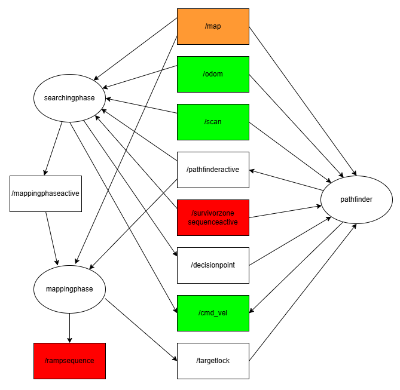

# Software info
## Overview
How to operate:
1. Turn on robot such that heading is the same as starting position in maze
2. Ensure both rpi and remote laptop are connected to the same wifi
3. SSH into the rpi
4. Postion the robot with its heading parallel to bottom of the maze
5. To run the program, run the following commands in seperate terminals the following order:
- rosbu (rpi)
- rslam (remote laptop)
- python3 survivorzonesequence.py (rpi)
- ros2 run auto_nav pathfinder (remote laptop)
- ros2 run auto_nav mappingphase (remote laptop)
- ros2 run auto_nav searchingphase (remote laptop)

The nodes will interact with each other in the following mannaer:

## Orientation of Robot
WEEEEEEEEE

## ROSBU and RSLAM

## Survivor Zone Sequence

## Searching Phase

## Mapping Phase

# Pathfinder
